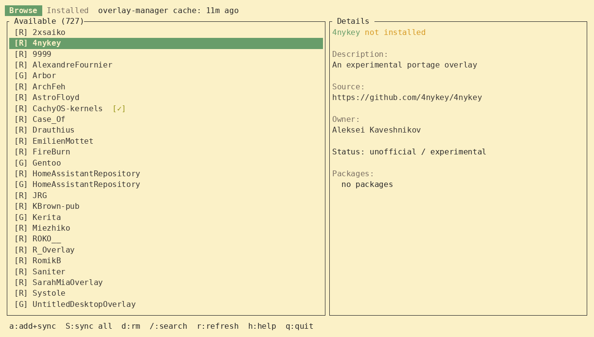

# overlay-manager

TUI application for managing Gentoo Portage overlays.


[](LICENSE)

Browse, search, add, remove, and sync Gentoo overlays from a fast terminal interface built with [ratatui](https://github.com/ratatui/ratatui).

## Features

- **Browse** available overlays from the [official Gentoo registry](https://api.gentoo.org/overlays/repositories.xml) and GitHub
- **Search** overlays and packages with real-time filtering (Esc keeps filter, double-Esc clears)
- **Detail panel** shows description, owner, disk size, last sync date, and installed packages
- **Sync freshness** colored indicators: `[✓]` green, `[~]` yellow, `[!]` red
- **Install/uninstall** overlays with a single keystroke — writes to `/etc/portage/repos.conf/`
- **Sync** a single overlay (`emaint sync -r`) or all at once (`emaint sync -a`)
- **View all packages** an overlay provides with latest versions, descriptions, and USE flags
- **Cache age** shown in status bar — know when to refresh
- **Confirmation dialogs** for destructive actions
- **Animated spinners** during sync and cache refresh
- **Auto-elevation** via `doas` or `sudo` at startup

## Preview



## Installation

### From source

```bash
git clone https://github.com/Darllowin/Overlay-manager.git
cd overlay-manager
cargo build --release
cp target/release/overlay-manager /usr/local/bin/
```


### Gentoo

```bash
eselect repository add darllowin_overlay git https://github.com/Darllowin/darllowin-overlay.git
emaint sync -r darllowin_overlay
emerge app-portage/overlay-manager
```

### Requirements

- Rust 1.95+
- `doas` or `sudo` for write operations
- `emaint` (part of `sys-apps/portage`) for syncing

## Usage

```bash
overlay-manager        # launch TUI (auto-elevates via doas/sudo if needed)
```

### Keybindings

| Key | Action |
|-----|--------|
| `j`/`k`/`↑`/`↓` | Navigate list |
| `g`/`G` | Top / bottom |
| `Tab` | Browse ↔ Installed tabs |
| `/` | Search / filter |
| `a` | Add overlay + sync |
| `S` | Sync all overlays |
| `d` | Remove overlay (config + files, with confirmation) |
| `r` | Refresh overlay cache |
| `Enter` | View all packages in selected overlay (with search and descriptions) |
| `h` | Help |
| `q` | Quit |

## License

MIT
